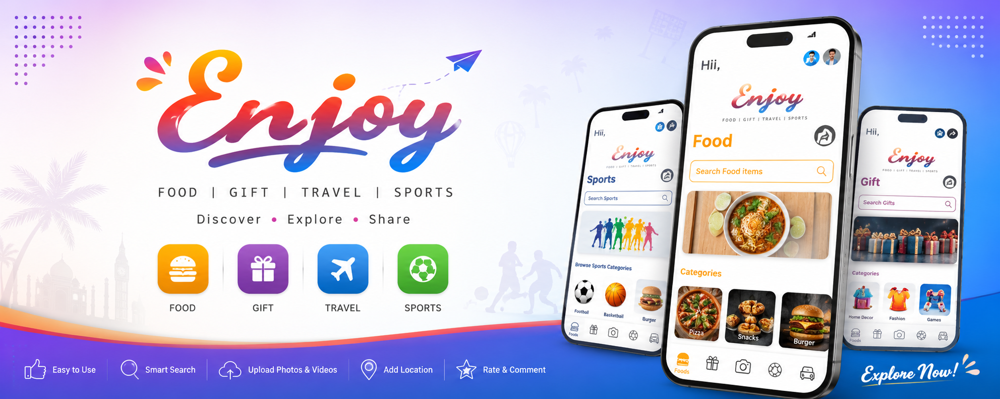

<div align="center">



# 🎉 Enjoy App

### Food 🍔 • Gift 🎁 • Travel ✈️ • Sports ⚽

A modern Flutter application that helps users discover, explore and share businesses, products and services across multiple categories.

<p>


</p>

</div>

---

# 📱 Overview

Enjoy App is a Flutter application designed to connect users with local businesses and services in four major categories:

🍔 Food

🎁 Gift

✈️ Travel

⚽ Sports

Users can search, browse categories, view details, upload photos/videos, add locations using Google Maps, and submit business information through an attractive and responsive interface.

---

# ✨ Features

✅ Beautiful Material UI

✅ Category-wise Home Screens

✅ Food Module

✅ Gift Module

✅ Sports Module

✅ Travel Module

✅ Smart Search

✅ Category & Subcategory Filtering

✅ Google Maps Integration

✅ Camera Support

✅ Image Upload

✅ Video Recording

✅ Video Upload

✅ Ratings

✅ Business Information Form

✅ Comments Section

✅ Responsive Design

---

# 🖼️ Application Screens

| Home | Food | Gift |
|------|------|------|
|  |  |  |

| Sports | Add Business | Camera |
|------|------|------|
|  |  |  |

---

# 🚀 Main Modules

### 🍔 Food
- Restaurants
- Cafes
- Fast Food
- Bakery
- Search Food Items

### 🎁 Gift
- Home Decor
- Fashion
- Games
- Flower Shops
- Gift Stores

### ⚽ Sports
- Football
- Basketball
- Cricket
- Indoor Games
- Outdoor Games

### ✈️ Travel
- Hotels
- Resorts
- Tourist Places
- Transportation
- Travel Agencies

---

# 🛠 Technology Stack

| Technology | Description |
|------------|-------------|
| Flutter | Mobile Development |
| Dart | Programming Language |
| GetX | State Management |
| SQLite | Local Database |
| Google Maps | Location Services |
| Image Picker | Image Upload |
| Video Player | Video Preview |
| Shared Preferences | Local Storage |

---

# 📂 Project Structure

```
lib/
├── models/
├── controllers/
├── services/
├── database/
├── screens/
├── widgets/
├── utils/
└── main.dart
```

---

# 🚀 Installation

```bash
git clone https://github.com/Kishan0369/enjoy-app.git

cd enjoy-app

flutter pub get

flutter run
```

---

# 📌 Future Enhancements

- Firebase Authentication
- Push Notifications
- Favorites
- Reviews
- Chat Support
- Payment Gateway
- Dark Mode

---

# 👨‍💻 Developer

### Kishan Prajapati

Flutter Developer

📧 your-email@gmail.com

⭐ If you like this project, don't forget to Star the repository.
